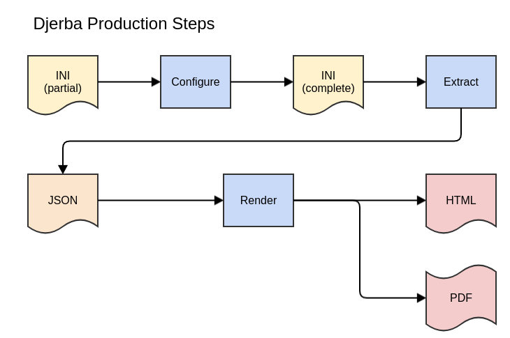

****************
How Djerba Works
****************

In this section we describe key concepts used by Djerba to direct the reporting process.

Production Steps
================

Report production in Djerba has three basic steps:
  1. Configure
  2. Extract
  3. Render

These are described in more detail in Table 1 and Figure 1 below.

+-----------+----------------+----------------+-------------------------------------------------------------------------------------------+
| Step      | Input          | Output         | Description                                                                               |
+===========+================+================+===========================================================================================+
| Configure | INI (partial)  | INI (complete) | Populate all configuration parameters,                                                    |
|           |                |                |                                                                                           |
|           |                |                | using defaults and/or automated queries                                                   |
+-----------+----------------+----------------+-------------------------------------------------------------------------------------------+
| Extract   | INI (complete) | JSON           | Process inputs to generate data for the report                                            |
+-----------+----------------+----------------+-------------------------------------------------------------------------------------------+
| Render    | JSON           | HTML, PDF      | Use the JSON data to write a human-readable                                               |
|           |                |                |                                                                                           |
|           |                |                | HTML document, which is then converted to PDF                                             |
+-----------+----------------+----------------+-------------------------------------------------------------------------------------------+

**Table 1:** Steps of Djerba report generation

**Figure 1:** Top-level Djerba report production flowchart

The use of each file format is as follows:

* `INI`_: simple plain-text configuration file
* `JSON`_: Machine-readable file with report data
* `HTML`_: Data transformed into a human-readable format
* `PDF`_: Self-contained document for sharing and archiving

.. _INI : https://docs.python.org/3/library/configparser.html
.. _JSON: https://www.w3schools.com/js/js_json.asp
.. _HTML : https://www.w3schools.com/html/html_intro.asp
.. _PDF : https://www.adobe.com/ca/acrobat/about-adobe-pdf.html

.. note:: Although INI is a widely used configuration format, it has `no official specification`_. Djerba INI files are required to be consistent with the Python `ConfigParser class`_, which serves as a *de facto* specification.

.. _no official specification : https://en.wikipedia.org/wiki/INI_file#Comparison_of_INI_parsers
.. _ConfigParser class : https://docs.python.org/3/library/configparser.html

The Djerba Software
===================

Introduction
------------

Djerba implements reporting in three basic steps: Configure, Extract, and Render. It is intended to be simple; robust; and easy to use, maintain, and extend.

The core Djerba code is written in the `Python`_ programming language, and Djerba makes extensive use of Python features and conventions. For further details, consult the `Python documentation`_.

Djerba is run under a `Linux`_ operating system. It makes use of Linux concepts such as `environment variables`_ to configure program behaviour.

.. _Python : https://www.python.org/
.. _Python documentation : https://docs.python.org/3/
.. _Linux: https://www.linux.org/
.. _environment variables: https://wiki.archlinux.org/title/Environment_variables

The ``djerba.py`` Script
------------------------

The main user interface for Djerba is a command-line script: ``djerba.py``

The ``djerba.py`` script has a number of subcommands or *modes* to set up and run the configure, extract, and render operations (Table 2). A user will typically run “setup” to generate an initial configuration file; “report” to generate a first draft PDF document for inspection; and “update” as needed to refine the PDF until it is ready for release. The intermediate output in JSON format provides a machine-readable version of all data needed to make the report, and may be saved for future reference. Djerba supports automated upload of the JSON report to a CouchDB database instance.

+-----------+-----------------------------------+--------------------------+---------------------------------------------------------------------------+
| Mode      | Input                             | Output                   | Description                                                               |
+===========+===================================+==========================+===========================================================================+
| setup     | Name of assay                     | Partial INI file         | Create a minimal INI file to be completed by the user                     |
+-----------+-----------------------------------+--------------------------+---------------------------------------------------------------------------+
| configure | Partial INI file                  | Fully specified INI file | Fill in configuration parameters                                          |
+-----------+-----------------------------------+--------------------------+---------------------------------------------------------------------------+
| extract   | Fully specified INI file          | JSON file                | Process and annotate inputs to generate data for the report               |
+-----------+-----------------------------------+--------------------------+---------------------------------------------------------------------------+
| render    | JSON file                         | HTML with optional PDF   | Transform JSON into a human readable HTML or PDF with tables, plots, etc. |
+-----------+-----------------------------------+--------------------------+---------------------------------------------------------------------------+
| report    | Partial INI file                  | JSON, HTML, and PDF      | Combine the configure, extract, and render operations                     |
+-----------+-----------------------------------+--------------------------+---------------------------------------------------------------------------+
| update    | JSON file                         | JSON, HTML, and PDF      | Re-run the extract and render operations for selected components,         |
|           |                                   |                          |                                                                           |
|           | partial INI file *or* summary text|                          | regenerating the HTML and PDF outputs                                     |
+-----------+-----------------------------------+--------------------------+---------------------------------------------------------------------------+

**Table 2**: Modes of the ``djerba.py`` command-line script

A user may run ``djerba.py --help`` for general options, or ``djerba.py $MODE --help`` for specific instructions on one of the above modes.

.. See the [user guide](user_guide_FIXME) for command-line syntax and options.

.. The user guide also details more specialized [command-line scripts](link_FIXME) used for report production.

Modular Components
==================

Introduction
------------

The architecture of Djerba is modular, enabling the report to be rapidly adapted to changing circumstances. Modular units of Djerba are known as *components*. Report components can be added, removed, or modified as needed. Each component can be run as a self-contained unit, to facilitate rapid testing and development. Components can read and write files in a shared *workspace*, allowing the supply of information from one component to another.

The INI configuration file is divided into named sections; each section represents a component.

Component Types
---------------

Core
^^^^

The core is the central element of Djerba and required in every report. The core is responsible for loading and executing other components in the correct order. It also sets certain report-wide parameters such as the name of the report author.

Plugins
^^^^^^^
Plugins are the main components used to generate the report. A plugin uses its INI configuration section to generate a JSON object conforming to a defined schema; and converts the JSON into HTML. Each plugin generates its own section of HTML; the combined HTML document is converted to PDF by the core. A plugin has **configure**, **extract**, and **render** methods which correspond to modes of the same name in Table 1\.

Helpers
^^^^^^^

Helpers do not produce HTML output, but can write to the workspace. They are principally used to gather operating parameters, which may then be distributed to multiple plugins.  

Mergers
^^^^^^^

Mergers take the output of multiple plugins, remove duplicates, and generate HTML output which is later converted to PDF. They are used to generate summaries of therapies or genes identified by plugins.

Runtime Priority and Dependencies
---------------------------------

Djerba has a concept of *priority*, to determine the order in which components are executed at runtime.

Each component has INI configuration parameters ``configure_priority``, ``extract_priority``, and ``render_priority``, which respectively determine priority for the configure, extract, and render steps. Priority order is resolved from lowest to highest number: Priority 1 runs before priority 2, and so on.

The order of sections in the HTML output is determined by ``render_priority``. We may want the configure or extract order to be different from the render order. For example, a *merger* component may be used to deduplicate and summarize therapies identified by multiple plugins. We want to run the merger near the *end* of the extract step, so input from upstream plugins is available. But we may wish to have the merger output near the *beginning* of the combined HTML document. Having separate priority parameters enables us to do this.

As in the above example, a component may depend on output from other components. A dependency may be implicit, and expressed in terms of runtime priorities. Djerba also supports explicit dependencies. Similarly to the priority configuration, a plugin has INI parameters ``depends_configure`` and ``depends_extract``, both of which accept a comma-separated list of component names. (Plugins intentionally *do not* have a ``depends_render`` parameter, because the render step requires complete JSON input to be supplied at runtime.)

Identifiers
-----------

Each Djerba component has an *identifier*. This is a string used as the main name of the component.

Plugin identifiers may be (almost) any combination of letters, numbers, and underscores. They may include dots ``.`` to indicate a `package hierarchy`_. Helper identifiers *always* end with the string ``_helper``, while merger identifiers *always* end with the string ``_merger``.

.. _package hierarchy: https://docs.python.org/3/tutorial/modules.html#packages

.. TODO See the Developer's Guide for more details

Component Locations
===================

Djerba loads its components from `packages`_ available to the `Python interpreter`_.

The default behaviour is to load components from a package named ``djerba``. This is the Python package which contains the core Djerba code, as well as a number of plugins used at OICR. Plugins may be located one or more levels below the top-level package, for example ``djerba.plugins.fusion`` (a fusion plugin) or ``djerba.plugins.tar.sample`` (a plugin to process sample information for targeted sequencing).

Djerba supports additional packages, allowing custom components to be kept in any location of the user's choice.

Packages which Djerba will search for plugins are configured as a colon-separated list, kept in the environment variable ``DJERBA_PACKAGES``. Djerba resolves packages by traversing the list from left to right. (As with any Python package, the code must be installed and visible on the `PYTHONPATH`_ environment variable.)

.. _packages: https://docs.python.org/3/tutorial/modules.html#packages
.. _Python interpreter: https://docs.python.org/3/tutorial/interpreter.html
.. _PYTHONPATH: https://docs.python.org/3/using/cmdline.html#envvar-PYTHONPATH

``DJERBA_PACKAGES`` Example
---------------------------

Suppose we have the following:

- Environment variable ``DJERBA_PACKAGES=voyager:enterprise:ds9``
- Python packages ``enterprise.plugins.cnv`` and ``ds9.plugins.cnv``
- INI config file including a section ``[cnv]``

Then Djerba will load the plugin ``enterprise.plugins.cnv`` in preference to ``ds9.plugins.cnv``, because ``enterprise`` is farther left in the ``DJERBA_PACKAGES`` list.

Specifically, the Djerba core code first checks the ``voyager`` package for a ``cnv`` plugin; when it does not find one, it checks ``enterprise``; having found the package ``enterprise.plugins.cnv``, it proceeds without examining the ``ds9`` package.

Note that, as in the above example, the name ``djerba`` does not have to be in the ``DJERBA_PACKAGES`` list -- unless you want to load components from the main Djerba repository.
