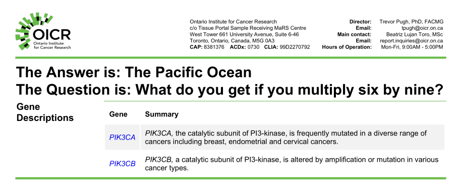

****************
How Djerba Works
****************

In this section we describe key concepts used by Djerba to direct the reporting process.

For details of how to run Djerba, see the :doc:`../../user_guide/user_guide`. This section describes more general principles of operation.

.. _production-steps:

Production Steps
================

Report production in Djerba has three basic steps:
  1. Configure
  2. Extract
  3. Render

These are described in more detail in Table 1 and Figure 1 below.

+-----------+----------------+----------------+-------------------------------------------------------------------------------------------+
| Step      | Input          | Output         | Description                                                                               |
+===========+================+================+===========================================================================================+
| Configure | INI (partial)  | INI (complete) | Populate all configuration parameters,                                                    |
|           |                |                |                                                                                           |
|           |                |                | using defaults and/or automated queries                                                   |
+-----------+----------------+----------------+-------------------------------------------------------------------------------------------+
| Extract   | INI (complete) | JSON           | Process inputs to generate data for the report                                            |
+-----------+----------------+----------------+-------------------------------------------------------------------------------------------+
| Render    | JSON           | HTML, PDF      | Use the JSON data to write a human-readable                                               |
|           |                |                |                                                                                           |
|           |                |                | HTML document, which is then converted to PDF                                             |
+-----------+----------------+----------------+-------------------------------------------------------------------------------------------+

**Table 1:** Steps of Djerba report generation

.. image:: ../images/production_steps.png

**Figure 1:** Top-level Djerba report production flowchart

The use of each file format is as follows:

* `INI`_: simple plain-text configuration file
* `JSON`_: Machine-readable file with report data
* `HTML`_: Data transformed into a human-readable format
* `PDF`_: Self-contained document for sharing and archiving

.. _INI : https://docs.python.org/3/library/configparser.html
.. _JSON: https://www.w3schools.com/js/js_json.asp
.. _HTML : https://www.w3schools.com/html/html_intro.asp
.. _PDF : https://www.adobe.com/ca/acrobat/about-adobe-pdf.html

.. note:: Although INI is a widely used configuration format, it has `no official specification`_. Djerba INI files are required to be consistent with the Python `ConfigParser class`_, which serves as a *de facto* specification.

.. _no official specification : https://en.wikipedia.org/wiki/INI_file#Comparison_of_INI_parsers
.. _ConfigParser class : https://docs.python.org/3/library/configparser.html

The Djerba Software
===================

Introduction
------------

Djerba implements reporting in three basic steps: Configure, Extract, and Render. It is intended to be simple; robust; and easy to use, maintain, and extend.

The core Djerba code is written in the `Python`_ programming language, and Djerba makes extensive use of Python features and conventions. For further details, consult the `Python documentation`_.

Djerba is run under a `Linux`_ operating system. It makes use of Linux concepts such as `environment variables`_ to configure program behaviour.

.. _Python : https://www.python.org/
.. _Python documentation : https://docs.python.org/3/
.. _Linux: https://www.linux.org/
.. _environment variables: https://wiki.archlinux.org/title/Environment_variables

.. _user-interface:

User Interface
--------------

The main user interface for Djerba is a command-line script: ``djerba.py``

The ``djerba.py`` script has a number of subcommands or *modes* to set up and run the configure, extract, and render operations (Table 2). A user will typically run “setup” to generate an initial configuration file; “report” to generate a first draft PDF document for inspection; and “update” as needed to refine the PDF until it is ready for release. The intermediate output in JSON format provides a machine-readable version of all data needed to make the report, and may be saved for future reference. Djerba supports automated upload of the JSON report to a CouchDB database instance.

+-----------+-----------------------------------+--------------------------+---------------------------------------------------------------------------+
| Mode      | Input                             | Output                   | Description                                                               |
+===========+===================================+==========================+===========================================================================+
| setup     | Name of assay                     | Partial INI file         | Create a minimal INI file to be completed by the user                     |
+-----------+-----------------------------------+--------------------------+---------------------------------------------------------------------------+
| configure | Partial INI file                  | Fully specified INI file | Fill in configuration parameters                                          |
+-----------+-----------------------------------+--------------------------+---------------------------------------------------------------------------+
| extract   | Fully specified INI file          | JSON file                | Process and annotate inputs to generate data for the report               |
+-----------+-----------------------------------+--------------------------+---------------------------------------------------------------------------+
| render    | JSON file                         | HTML with optional PDF   | Transform JSON into a human readable HTML or PDF with tables, plots, etc. |
+-----------+-----------------------------------+--------------------------+---------------------------------------------------------------------------+
| report    | Partial INI file                  | JSON, HTML, and PDF      | Combine the configure, extract, and render operations                     |
+-----------+-----------------------------------+--------------------------+---------------------------------------------------------------------------+
| update    | JSON file                         | JSON, HTML, and PDF      | Re-run the extract and render operations for selected components,         |
|           |                                   |                          |                                                                           |
|           | partial INI file *or* summary text|                          | regenerating the HTML and PDF outputs                                     |
+-----------+-----------------------------------+--------------------------+---------------------------------------------------------------------------+

**Table 2**: Modes of the ``djerba.py`` command-line script

A user may run ``djerba.py --help`` for general options, or ``djerba.py $MODE --help`` for specific instructions on one of the above modes.

.. See the [user guide](user_guide_FIXME) for command-line syntax and options.

.. The user guide also details more specialized [command-line scripts](link_FIXME) used for report production.

Modular Components
==================

Introduction
------------

The architecture of Djerba is modular, enabling the report to be rapidly adapted to changing circumstances. Modular units of Djerba are known as *components*. Report components can be added, removed, or modified as needed. Each component can be run as a self-contained unit, to facilitate rapid testing and development. Components can read and write files in a shared *workspace*, allowing the supply of information from one component to another.

The INI configuration file is divided into named sections; each section represents a component.

Component Types
---------------

Core
^^^^

The core is the central element of Djerba and required in every report. The core is responsible for loading and executing other components in the correct order. It also sets certain report-wide parameters such as the name of the report author.

Plugins
^^^^^^^
Plugins are the main components used to generate the report. A plugin uses its INI configuration section to generate a JSON object conforming to a defined schema; and converts the JSON into HTML. Each plugin generates its own section of HTML; the combined HTML document is converted to PDF by the core. A plugin has **configure**, **extract**, and **render** methods which correspond to modes of the same name in Table 1\.

Helpers
^^^^^^^

Helpers do not produce HTML output, but can write to the workspace. They are principally used to gather operating parameters, which may then be distributed to multiple plugins.  

Mergers
^^^^^^^

Mergers take the output of multiple plugins, remove duplicates, and generate HTML output which is later converted to PDF. They are used to generate summaries of therapies or genes identified by plugins.

Runtime Priority and Dependencies
---------------------------------

Djerba has a concept of *priority*, to determine the order in which components are executed at runtime.

Each component has INI configuration parameters ``configure_priority``, ``extract_priority``, and ``render_priority``, which respectively determine priority for the configure, extract, and render steps. Priority order is resolved from lowest to highest number: Priority 100 runs before priority 200, and so on. (Djerba development has an informal convention of setting priorities with an increment of 100.)

The order of sections in the HTML output is determined by ``render_priority``. We may want the configure or extract order to be different from the render order. For example, a *merger* component may be used to deduplicate and summarize therapies identified by multiple plugins. We want to run the merger near the *end* of the extract step, so input from upstream plugins is available. But we may wish to have the merger output near the *beginning* of the combined HTML document. Having separate priority parameters enables us to do this.

As in the above example, a component may depend on output from other components. A dependency may be implicit, and expressed in terms of runtime priorities. Djerba also supports explicit dependencies. Similarly to the priority configuration, a plugin has INI parameters ``depends_configure`` and ``depends_extract``, both of which accept a comma-separated list of component names. (Plugins intentionally *do not* have a ``depends_render`` parameter, because the render step requires complete JSON input to be supplied at runtime.)

.. _finding_loading_components:

Finding and Loading Components
==============================

The Top-Level Package
---------------------

Djerba loads its components from `packages`_ available to the `Python interpreter`_.

The default behaviour is to load components from a package named ``djerba``. This is the Python package which contains the core Djerba code, as well as a number of plugins used at OICR.

Djerba supports additional packages, allowing custom components to be maintained in their own software repositories.

Packages which Djerba will search for plugins are configured as a colon-separated list, kept in the environment variable ``DJERBA_PACKAGES``. Djerba resolves packages by traversing the list from left to right. (As with any Python package, the code must be installed and visible on the `PYTHONPATH`_ environment variable.)

.. _packages: https://docs.python.org/3/tutorial/modules.html#packages
.. _Python interpreter: https://docs.python.org/3/tutorial/interpreter.html
.. _PYTHONPATH: https://docs.python.org/3/using/cmdline.html#envvar-PYTHONPATH

.. TODO See the Developer's Guide for more details

Component Identifiers
---------------------

The main name for each Djerba component is known as its *identifier*. Djerba components exist within a name space -- if two components have the same identifier, they cannot be loaded at the same time.

The identifier is closely related to the `Python package`_ which contains the component code. A Python package name represents a directory hierarchy, with directory levels separated by dots ``.``.

For example, the Python package ``enterprise.plugins.wgts.snv_indel`` may contain a plugin with identifier ``wgts.snv_indel``. **Table 2** breaks this down in more detail.

============== ===========
Item           Description
============== ===========
``enterprise`` Top-level package name. Must appear in ``DJERBA_PACKAGES`` for the plugin to be loaded at runtime.
``plugins``    Second-level package name. Djerba plugins must have ``plugins`` as the second-level name (and similarly for helpers and mergers).
``wgts``       Subdirectory, if any. A plugin may simply be located in the ``plugins`` directory, or it may be under one or more subdirectories.
``snv_indel``  The name of the plugin package.
============== ===========

**Table 2**. Levels in the Python package hierarchy for Djerba plugins, explained using the example ``enterprise.plugins.wgts.snv_indel``.

The package names under the ``plugins`` directory, separated by dots, make up the plugin *identifier*. This is the name used in the INI file to run Djerba and generate a report. For example, the above plugin has the identifier ``wgts.snv_indel`` and will have a corresponding section header ``[wgts.snv_indel]`` in the INI file.

Identifiers for helpers and mergers are similar, except their lowest-level package names *always* end with ``_helper`` and ``_merger`` respectively.

.. _Python package: https://docs.python.org/3/tutorial/modules.html#packages

Plugin Loading Example
----------------------

Suppose we have the following:

- Environment variable ``DJERBA_PACKAGES=voyager:enterprise:ds9``
- Python packages ``enterprise.plugins.cnv`` and ``ds9.plugins.cnv``
- INI config file including a section ``[cnv]``

Then Djerba will load the plugin ``enterprise.plugins.cnv`` in preference to ``ds9.plugins.cnv``, because ``enterprise`` is farther left in the ``DJERBA_PACKAGES`` list.

Specifically, the Djerba core code first checks the ``voyager`` package for a ``cnv`` plugin; when it does not find one, it checks ``enterprise``; having found the package ``enterprise.plugins.cnv``, it proceeds without examining the ``ds9`` package.

.. note:: As in the above example, the name ``djerba`` does not have to be in the ``DJERBA_PACKAGES`` list -- unless you want to load components from the main Djerba repository.

Input and Output Examples
=========================

Minimal Example
---------------

Djerba writes each report in a machine-readable JSON format, in addition to human-readable HTML and PDF. We can demonstrate the output format with a simple example.

The minimal valid INI configuration file for Djerba is:

::

   [core]

That's all! The ``[core]`` component is required for all reports, and we have not specified any others.

Generating a report with the above config does not write any HTML or PDF output, because those are produced by plugins. However, it does write JSON output like this, to a file named ``OICR-CGI-7ec4b11d2007477faa7935d0a09e6fb7_report.json``.

::

   {
    "core": {
        "author": "CGI Author",
        "document_config": "document_config.json",
        "report_id": "OICR-CGI-7ec4b11d2007477faa7935d0a09e6fb7",
        "core_version": "1.13.0",
        "extract_time": "2026-08-26_16:58:55 -0400"
    },
    "plugins": {},
    "mergers": {},
    "config": {
        "core": {
            "attributes": "",
            "depends_configure": "",
            "depends_extract": "",
            "configure_priority": "100",
            "extract_priority": "100",
            "render_priority": "100",
            "author": "CGI Author",
            "report_id": "OICR-CGI-7ec4b11d2007477faa7935d0a09e6fb7",
            "report_version": "1",
            "input_params": "input_params.json",
            "document_config": "document_config.json"
        }
    },
    "html_cache": {}

Notice that the output filename is the ``report_id`` in the JSON, with the suffix ``_report.json``. No ID was specified, so Djerba falls back to a randomly generated `unique identifier`_.

.. _unique identifier: https://docs.python.org/3/library/uuid.html

While the document does not contain any data for rendering, it does have some basic information on the report:

* **author**: The name of the report author, in this case a default placeholder
* **document_config**: A configuration file used for document generation
* **report_id**: An automatically generated placeholder ID for the report
* **core_version**: Version number of the Djerba core software
* **extract_time**: Time the extract step was run

This is followed by empty objects for plugin and merger output. Then, it has the set of config parameters used to generate the report. Since we did not specify any parameters for ``[core]``, all of the values reported in the JSON are defaults. Helper components have no corresponding output object, because they do not generate HTML output; they can only write files to the report workspace, for use by plugins or helpers. Any helper components used *do* appear in the ``config`` object in the JSON document.

Notice that we have ``depends`` and ``priority`` parameters. The ``core`` component, by definition, has no dependencies; and it has priority 100, because we want it to run before any other components. (Remember that priorities are resolved in *ascending* order, and by convention they are incremented by 100; so 100 runs before 200, 300 and so on.)

Finally, we see the ``html_cache`` section. In a report with HTML output, this would be populated to allow easier regeneration of the report in the "update" mode of the main ``djerba.py`` script.

Setting INI Parameters
----------------------

Let us take a step up from the minimal example, by setting parameters in ``[core]``. If we use the INI file:

::

   [core]
   report_id = demo
   author = Dr. Beverly Crusher

The report is now written to ``demo_report.json`` instead of a randomly generated filename, and the parameters propagate through:

::

   {
    "core": {
        "author": "Dr. Beverly Crusher",
        "document_config": "document_config.json",
        "report_id": "demo",
        "core_version": "1.13.0",
        "extract_time": "2026-08-26_17:58:23 -0400"
    },
    ... [further output truncated]

Our next step is to add some plugins and produce a report.

Configuring Plugins
-------------------

To use a plugin, we simply add its identifier and any needed parameters to the INI file. For example:

::

   [core]
   report_id = demo
   author = Dr. Beverly Crusher

   [gene_information_merger]

   [demo2]
   question = question.txt
   demo2_param = The Pacific Ocean

This uses components from the main Djerba repository: Specifically the ``demo2`` plugin, which as the name suggests is a simple plugin for demonstration purposes; and the ``gene_information_merger``, which is used in production to deduplicate and report information on genes of interest.

Here is part of the JSON generated:

::

   {
    "core": {
        "author": "Dr. Beverly Crusher",
        "document_config": "document_config.json",
        "report_id": "demo",
        "core_version": "1.13.0",
        "extract_time": "2026-08-27_09:42:26 -0400"
    },
    "plugins": {
        "demo2": {
            "plugin_name": "demo2 plugin",
            "version": "1.0.0",
            "priorities": {
                "configure": 300,
                "extract": 300,
                "render": 300
            },
            "attributes": [
                "clinical"
            ],
            "merge_inputs": {
                "gene_information_merger": [
                    {
                        "Gene": "PIK3CA",
                        "Gene_URL": "https://www.oncokb.org/gene/PIK3CA",
                        "Chromosome": "3q26.32",
                        "Summary": "PIK3CA, the catalytic subunit of PI3-kinase, is frequently mutated in a diverse range of cancers including breast, endometrial and cervical cancers."
                    },
                    {
                        "Gene": "PIK3CB",
                        "Gene_URL": "https://www.oncokb.org/gene/PIK3CB",
                        "Chromosome": "3q22.3",
                        "Summary": "PIK3CB, a catalytic subunit of PI3-kinase, is altered by amplification or mutation in various cancer types."
                    }
                ]
            },
            "results": {
                "answer": "The Pacific Ocean",
                "question": "What do you get if you multiply six by nine?"
            }
        }
    },
    ... [further output truncated]

.. note:: The JSON output from plugins includes `base64-encoded`_ data blocks, and is not intended to be human-readable in its raw state. If manually reviewing the JSON, we recommend opening it in a browser or using a program such as `jq`_. Complete JSON output from the above demonstration is: :download:`demo_report.json` 

.. _base64-encoded: https://www.redhat.com/en/blog/base64-encoding
.. _jq: https://jqlang.org/

This time, we have also generated HTML and PDF output, in files ``demo_report.clinical.html`` and ``demo_report.clinical.pdf`` respectively. The output appears in **Figure 2**:

**Figure 2**: Simple demonstration of Djerba PDF output

The document has a standard header and format for OICR clinical reports. We can also see a question and answer output by the plugin, and gene information output by the merger.

.. note:: The ``demo2`` plugin has "clinical" in its ``attributes`` list; this means it uses clinical document templates and the string "clinical" appears in the HTML and PDF filenames. The "clinical" string does *not* appear in the JSON filename, because the clinical format is one of several which can be generated from a given JSON file.
