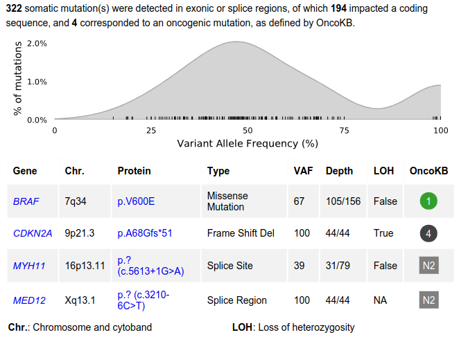

=====================
wgts.snv_indel plugin
=====================

Introduction
------------

The ``wgts.snv_indel`` plugin reports SNVs and indels in WGTS/WGS data.

It is important for displaying variants and identifying treatment options in clinical reporting.

Key steps of the plugin workflow include:

* Filtering the input data to discard unwanted variant calls
* Annotation of calls using `OncoKB`_ to find oncogenic status and treatment options, if any
* Computing the Loss of Heterozygosity (LOH) status for each variant
* Producing a table of data for each variant, and summary metrics for the genome
* Generating a histogram of variant allele frequency (VAF)
* Generating Integrative Genomics Viewer (IGV) links for the `OICR Whizbam server`_

.. _OICR Whizbam server : https://whizbam.oicr.on.ca/
.. _OncoKB: https://www.oncokb.org/

Dependencies
------------

The following Python libraries are used for plotting:

* `pandas`_
* `matplotlib`_
* `seaborn`_

.. _pandas: https://pandas.pydata.org/
.. _matplotlib: https://matplotlib.org/
.. _seaborn: https://seaborn.pydata.org/

Input
------

Required
^^^^^^^^

A gzip-compressed MAF file with extension ``.maf.gz``, as output by the `variantEffectPredictor`_ workflow.

.. _variantEffectPredictor: https://github.com/oicr-gsi/variantEffectPredictor

Optional
^^^^^^^^

If the Djerba `expression helper`_ has written output to the workspace, it will be used to display gene expression metrics.

.. _expression helper: https://github.com/oicr-gsi/djerba/tree/main/src/lib/djerba/helpers/expression_helper
.. TODO link to expression helper documentation when available

Data Processing
---------------

Filtering
^^^^^^^^^

Rows from the input MAF file are `filtered`_ using a strict set of criteria, which typically discards >99.9% of inputs.

Filtering is based on column values from the MAF file, such as ``t_depth``. Consult the `MAF documentation`_ for further details.

A MAF input row is **kept** for downstream analysis if **all** of the following statements are true:

1. ``t_depth >= 1``
2. ``t_alt_count >= 3``
3. Above the minimum VAF threshold: ``t_alt_count/t_depth >= 0.1``
4. Either of the following is true:

   1. ``Matched_Norm_Sample_Barcode`` is **not** ``unmatched``, *OR*
   2. ``gnomAD_AF`` is non-empty and less than 0.001

5. ``biotype`` is ``protein_coding``
6. ``variant_classification`` is any of:

   1. ``5Flank``
   2. ``Frame_Shift_Del``
   3. ``Frame_Shift_Ins``
   4. ``In_Frame_Del``
   5. ``In_Frame_Ins``
   6. ``Missense_Mutation``
   7. ``Nonsense_Mutation``
   8. ``Nonstop_Mutation``
   9. ``Silent``
   10. ``Splice_Region``
   11. ``Splice_Site``
   12. ``Targeted_Region``
   13. ``Translation_Start_Site``

7. Flags in ``FILTER`` do **not** include:

   1. ``str_contraction``, *OR*
   2. ``t_lod_fstar``

8. Either of the following is true:

   1. ``variant_classification`` is **not** ``5'Flank``, *OR*
   2. ``hugo_symbol`` is ``TERT``

9. Either of the following is true:

   1. ``hugo_symbol`` is **not** ``TERT``, *OR*
   2. The variant is **not** either of the following "*TERT* hotspots":

      1. nucleotide polymorphism G > A (chr5, 1295113 assembly GRCh38), *OR*
      2. nucleotide polymorphism G > A (chr5, 1295135 assembly GRCh38)

.. _filtered: https://github.com/oicr-gsi/djerba/blob/a45e70a30485bb415723d019b47fdfc6400e7775/src/lib/djerba/plugins/wgts/snv_indel/tools.py#L85
.. _MAF documentation: https://docs.gdc.cancer.gov/Data/File_Formats/MAF_Format/

Comparison with TMB Computation
^^^^^^^^^^^^^^^^^^^^^^^^^^^^^^^

The following ``variant_classification`` values are *included* by the MAF filter, but *excluded* from computation of tumour mutation burden (TMB) by the `genomic landscape plugin`_.

1. ``3'Flank``
2. ``3'UTR``
3. ``5'Flank``
4. ``5'UTR``
5. ``Silent``
6. ``Splice_Region``
7. ``Targeted_Region``

.. _genomic landscape plugin: https://github.com/oicr-gsi/djerba/tree/main/src/lib/djerba/plugins/genomic_landscape

Variant Annotation
^^^^^^^^^^^^^^^^^^

Somatic mutations are annotated using `OncoKB`_, as described in the `Djerba documentation`_.

`OncoKB`_ categorizes mutations by the level of evidence they are oncogenic; and identifies treatment options, if known.

.. _Djerba documentation: https://djerba.readthedocs.io/en/latest/user_guide/user_guide.html#variant-annotation
.. _OncoKB: https://www.oncokb.org/

Loss of Heterozygosity
^^^^^^^^^^^^^^^^^^^^^^

We define the following quantities:

* *p* = sample purity
* *v* = tumour VAF
* *n* = copy number, ``CN`` column in the MAF file
* *m* = minor allele copy number, ``MACN`` column in the MAF file

`Loss of heterozygosity`_ (LOH) occurs when **both** of the following statements are true:

.. math::

   \frac{vn}{p} > n - 0.5
   
.. math::

   m \le 0.5

.. _Loss of heterozygosity: https://github.com/oicr-gsi/djerba/blob/a45e70a30485bb415723d019b47fdfc6400e7775/src/lib/djerba/plugins/wgts/snv_indel/tools.py#L139

Special Cases for Protein Names
^^^^^^^^^^^^^^^^^^^^^^^^^^^^^^^

If the input MAF file lists the gene as *BRAF* and the protein as p.V640E, the protein name is changed to p.V600E for output.

For splice site mutations, the protein is denoted by the HGVS coding sequence name, in the ``HGVSc`` column of the MAF file.

Output
------

Summary metrics
^^^^^^^^^^^^^^^

* Total somatic mutations
* Total coding sequence mutations
* Total oncogenic mutations as identified by OncoKB

Table columns
^^^^^^^^^^^^^

The output table reports any variants with an OncoKB category of N2 (Likely Oncogenic) or higher.

1. Gene name and link to OncoKB
2. Chromosome and chromosomal arm
3. Protein name and link to OncoKB
4. Type of mutation
5. Variant Allele Frequency (VAF)
6. Depth: Variant reads / Total reads
7. Percentile of expression, computed in TPM (transcripts per million) with reference to the TCGA cohort. Not available in WGS reports.
8. LOH: True or False
9. OncoKB level

Plots
^^^^^

* Histogram of VAF for all somatic mutations

Workspace Files
^^^^^^^^^^^^^^^

1. ``data_mutations_extended.txt``: TSV file in a modified MAF format, following OncoKB annotation
2. ``data_mutations_extended_oncogenic.txt``: As above, but for oncogenic mutations only
3. ``filtered_maf.tsv``: File with variants which remain after initial filtering

Whizbam Links
^^^^^^^^^^^^^

The plugin generates Integrative Genomics Viewer (IGV) links for the `OICR Whizbam server`_, and inserts them as the final column in ``data_mutations_extended.txt`` and ``data_mutations_extended_oncogenic.txt``.

.. _OICR Whizbam server : https://whizbam.oicr.on.ca/

Example Report Output
^^^^^^^^^^^^^^^^^^^^^

**Figure 1**: Example output from the wgts.snv_indel plugin. Expression values are omitted because this was a WGS report.
